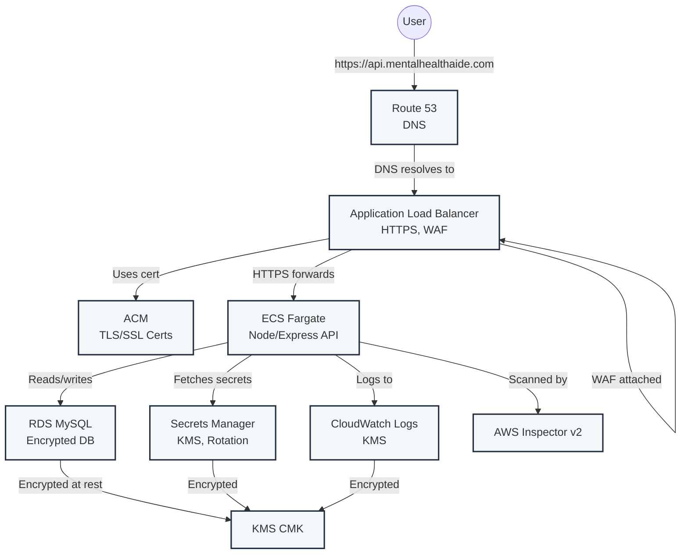

# Backend AWS Architecture (api.mentalhealthaide.com)

---

**Flow:**
1. User/API client calls `https://api.mentalhealthaide.com`.
2. Route 53 resolves the domain to the ALB.
3. ALB (with ACM TLS cert and WAF) forwards HTTPS traffic to ECS Fargate service.
4. ECS runs the Node/Express backend, connects to RDS (MySQL), fetches **db_password** and **jwt_secret** from Secrets Manager (generated/rotated by Terraform, encrypted with KMS), and logs to CloudWatch (encrypted with KMS).
5. Inspector v2 scans ECS/ECR for vulnerabilities.

---

**Key AWS Services & Security Practices:**
- **ECS Fargate:** Runs backend containers
- **ALB:** Load balancing, HTTPS, WAF
- **RDS:** MySQL database, encrypted at rest with KMS, password rotated via Secrets Manager
- **Secrets Manager:** Generates and rotates db_password/jwt_secret (KMS-encrypted); Twilio/OpenAI keys are NOT managed here
- **CloudWatch:** Logs/metrics, encrypted with KMS
- **Route 53:** DNS
- **ACM:** TLS/SSL certificates
- **KMS:** Encryption for RDS, CloudWatch, Secrets
- **Inspector v2:** Vulnerability scanning for ECR/EC2/ECS

---

**Operational Best Practices:**
- Secrets are rotated automatically (30 days) via Secrets Manager
- No hardcoded secrets in tfvars or code
- Use `terraform plan` to detect drift; re-run `apply`/`destroy` to recover from interruptions
- S3, RDS, and logs are encrypted and versioned 