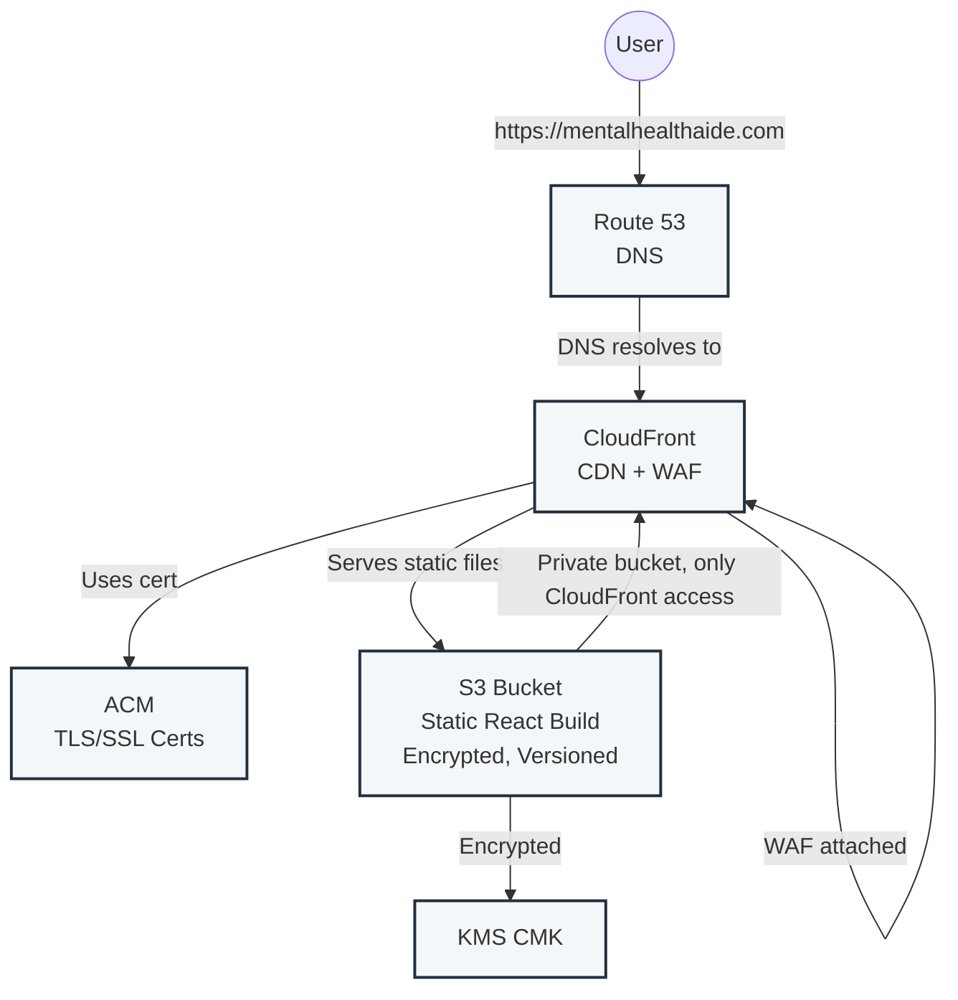

# Frontend AWS Architecture (mentalhealthaide.com)

---

**Flow:**
1. User visits `https://mentalhealthaide.com`.
2. Route 53 resolves the domain to CloudFront.
3. CloudFront (with ACM TLS cert and WAF) serves the static React app from the S3 bucket.
4. S3 bucket is private, encrypted (SSE-S3 or KMS), versioned, and only accessible by CloudFront.

---

**Key AWS Services & Security Practices:**
- **S3:** Stores static frontend files, encrypted and versioned
- **CloudFront:** CDN, HTTPS, WAF attached
- **Route 53:** DNS
- **ACM:** TLS/SSL certificates (DNS validated)
- **KMS:** Encryption for S3

---

**Operational Best Practices:**
- S3 bucket is private, encrypted, and versioned
- CloudFront cache invalidation after deploy
- Use `terraform plan` to detect drift; re-run `apply`/`destroy` to recover from interruptions 