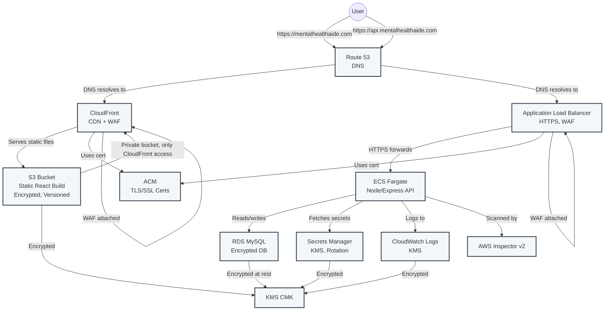
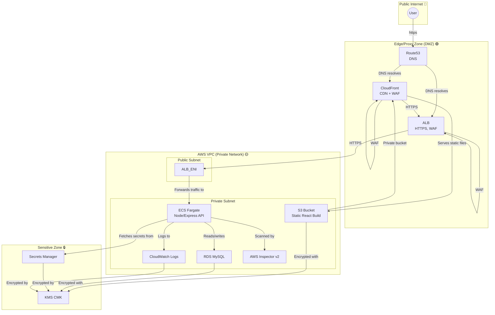

# Full-Stack AWS Architecture (mentalhealthaide.com)

---

**Flow:**
- User visits `https://mentalhealthaide.com` (frontend):
  1. Route 53 resolves to CloudFront.
  2. CloudFront (with ACM TLS cert and WAF) serves static React app from S3 (private, encrypted, versioned).
- User/API client calls `https://api.mentalhealthaide.com` (backend):
  1. Route 53 resolves to ALB.
  2. ALB (with ACM TLS cert and WAF) forwards HTTPS traffic to ECS Fargate service.
  3. ECS runs Node/Express backend, connects to RDS (MySQL), fetches **db_password** and **jwt_secret** from Secrets Manager (generated/rotated by Terraform, encrypted with KMS), logs to CloudWatch (encrypted with KMS), and is scanned by Inspector v2.

---

**Key AWS Services & Security Practices:**
- **S3:** Stores static frontend files, encrypted and versioned
- **CloudFront:** CDN, HTTPS, WAF attached
- **ALB:** Load balancing, HTTPS, WAF
- **ECS Fargate:** Runs backend containers
- **RDS:** MySQL database, encrypted at rest with KMS, password rotated via Secrets Manager
- **Secrets Manager:** Generates and rotates db_password/jwt_secret (KMS-encrypted); Twilio/OpenAI keys are NOT managed here
- **CloudWatch:** Logs/metrics, encrypted with KMS
- **Route 53:** DNS
- **ACM:** TLS/SSL certificates (DNS validated)
- **KMS:** Encryption for S3, RDS, CloudWatch, Secrets
- **Inspector v2:** Vulnerability scanning for ECR/EC2/ECS

---

**Operational Best Practices:**
- Secrets are rotated automatically (30 days) via Secrets Manager
- No hardcoded secrets in tfvars or code
- S3, RDS, and logs are encrypted and versioned
- CloudFront cache invalidation after deploy
- Use `terraform plan` to detect drift; re-run `apply`/`destroy` to recover from interruptions 

---

## Security Boundary Diagram (Granular)

**Legend:**
- 🔵 Public: User, Internet
- 🟢 DMZ: Route53, CloudFront, ALB (public-facing)
- 🟡 VPC: All private AWS resources (subnets, ECS, RDS, S3, CloudWatch, Inspector)
- 🔒 Sensitive: Secrets Manager, KMS

**Notes:**
- ALB2 represents the ENI (Elastic Network Interface) of the ALB inside the public subnet of the VPC.
- Only ALB and CloudFront are exposed to the public; all other resources are private.
- Security Groups and NACLs restrict traffic between subnets and services.
- S3 is private, only accessible by CloudFront (via Origin Access Identity/Control).
- RDS is only accessible from ECS (security group rules).
- Secrets Manager and KMS are only accessible from ECS and authorized AWS services. 